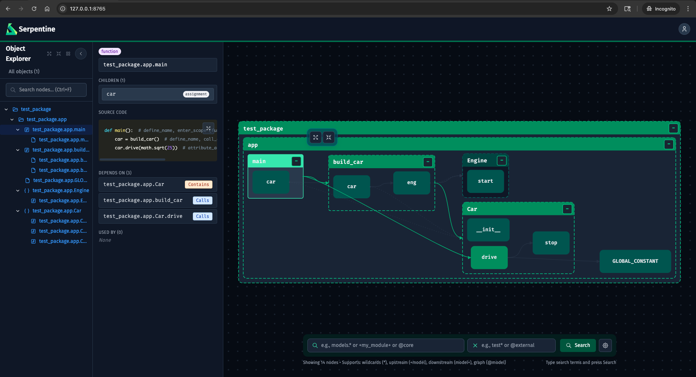

<p align="center">
  
</p>

# Serpentine

Fast dependency graph analysis and visualization for Python, JavaScript/TypeScript, and Rust projects.



Serpentine analyzes your codebase using a Rust-powered parser and displays an interactive dependency graph in your browser. It resolves dependencies down to the variable and call level and watches for file changes in real time.

---

## Features

- **Multi-language**: Python, JavaScript, TypeScript, and Rust
- **Deep resolution**: Resolves calls and type references, not just import edges
- **Interactive graph**: Expandable nodes, search, pan/zoom, collapsible modules
- **Real-time updates**: File watcher pushes changes via WebSocket
- **Agent-ready CLI**: Structured JSON output with selectors for use in AI agent workflows

---

## Installation

### Pre-built wheels (recommended)

Download the wheel for your platform from the [latest GitHub Release](https://github.com/serpentine-parser/serpentine/releases/latest). No Rust toolchain required.

```bash
pip install serpentine-*.whl
```

### From source

> **Prerequisites**: Python 3.12+, [Rust toolchain](https://rustup.rs), Node.js 18+

```bash
git clone https://github.com/serpentine-parser/serpentine.git
cd serpentine

# 1. Build the frontend
cd frontend && npm install && npm run build && cd ..

# 2. Build the Rust extension and install the CLI
make install
```

This installs the `serpentine` CLI globally via `uv tool`, which you will need to [install separately](https://docs.astral.sh/uv/getting-started/installation/).

---

## Quick Start

Navigate to any Python, JavaScript/TypeScript, or Rust project and run:

```bash
serpentine serve
```

Serpentine will analyze the project, start a local server at `http://127.0.0.1:8765`, and open the visualization in your browser. File changes are detected automatically and the graph updates in real time.

---

## CLI Reference

### `serpentine serve`

Start the visualization server with live file watching.

```
serpentine serve [PATH] [OPTIONS]

Arguments:
  PATH    Directory to analyze (default: current directory)

Options:
  -p, --port INT        Port to run the server on (default: 8765)
  -h, --host TEXT       Host to bind to (default: 127.0.0.1)
  --no-browser          Don't open browser automatically
  --no-watch            Disable file watching (static analysis only)
```

### `serpentine analyze`

Analyze a project and output the full dependency graph as JSON.

```
serpentine analyze [PATH] [OPTIONS]

Options:
  -o, --output PATH           Write output to file instead of stdout
  --pretty                    Pretty-print JSON
  --select TEXT               Selector expression to filter nodes (see below)
  --exclude TEXT              Exclusion pattern (same syntax as --select)
  --no-cfg                    Strip control-flow graph data from nodes
  --edges-only                Output only the edges array (compact)
  --include-standard          Include stdlib nodes (default: off)
  --include-third-party       Include third-party nodes (default: off)
  --state TEXT                Filter by change state: modified,added,deleted
```

### `serpentine catalog`

Flat list of all nodes — useful for discovering node IDs before building selectors.

```
serpentine catalog [PATH] [OPTIONS]

Options:
  --filter TEXT               Glob pattern matched against node id and name
                              (repeatable; multiple patterns = union)
  --no-assignments            Exclude variable/assignment nodes
  -o, --output PATH           Write output to file instead of stdout
  --pretty                    Pretty-print JSON
  --include-standard          Include stdlib nodes
  --include-third-party       Include third-party nodes
```

### `serpentine stats`

Quick summary of project scale: node/edge counts by type and origin.

```
serpentine stats [PATH] [OPTIONS]

Options:
  --pretty                    Pretty-print JSON
  --include-standard          Include stdlib nodes
  --include-third-party       Include third-party nodes
```

---

## Querying the Graph

`serpentine analyze` and `serpentine catalog` accept `--select` and `--exclude` to slice the graph down to just the nodes you care about. This is useful for large codebases where the full graph is too noisy, or for piping results into other tools.

### Step 1 — Find your node IDs

Every node has a dotted ID that reflects its location in the codebase. Use `catalog` to discover them:

```bash
serpentine catalog . --no-assignments --pretty
```

This outputs a flat list of every module, class, and function with its ID:

```json
{
  "nodes": [
    { "id": "src.auth.models.User", "name": "User", "type": "class", ... },
    { "id": "src.auth.views.login", "name": "login", "type": "function", ... },
    { "id": "src.payments.stripe.charge", "name": "charge", "type": "function", ... }
  ]
}
```

Narrow it down with `--filter` (glob matched against both ID and name):

```bash
# Find everything related to auth
serpentine catalog . --filter "*auth*" --no-assignments --pretty

# Find by name across modules
serpentine catalog . --filter "*User*" --no-assignments --pretty
```

### Step 2 — Select nodes and their dependencies

Once you have IDs, use `--select` with `serpentine analyze`. The selector controls which nodes (and their relationships) appear in the output.

**Plain pattern** — just the matching nodes:

```bash
serpentine analyze --select "src.auth.*" --no-cfg --pretty
```

**`+pattern`** — the matching nodes _plus everything they depend on_ (upstream):

```bash
# What does the login view need to work?
serpentine analyze --select "+src.auth.views.login" --no-cfg --pretty
```

**`pattern+`** — the matching nodes _plus everything that depends on them_ (downstream):

```bash
# What breaks if I change the User model?
serpentine analyze --select "src.auth.models.User+" --no-cfg --pretty
```

**`+pattern+`** — both directions (full blast radius):

```bash
serpentine analyze --select "+src.payments.*+" --no-cfg --pretty
```

**`@pattern`** — the full connected component (everything reachable in any direction):

```bash
serpentine analyze --select "@src.auth.*" --no-cfg --pretty
```

**Bounded hops** — limit how many levels to traverse:

```bash
# 2 levels of dependencies upstream, 1 level downstream
serpentine analyze --select "2+src.auth.views.login+1" --no-cfg --pretty
```

**Multiple selectors** — comma-separated, combined as a union:

```bash
serpentine analyze --select "+src.auth.*,+src.payments.*" --no-cfg --pretty
```

### Step 3 — Exclude noise

`--exclude` removes nodes from the result (including their descendants):

```bash
# Show auth and its deps, but skip test files
serpentine analyze --select "+src.auth.*" --exclude "*test*" --no-cfg --pretty
```

### Glob pattern rules

`*` in a selector matches any characters **including dots**, so it crosses module boundaries:

| You want                           | Use          |
| ---------------------------------- | ------------ |
| All nodes whose ID contains "auth" | `*auth*`     |
| All children of a specific module  | `src.auth.*` |
| A class anywhere in the project    | `*.User`     |
| All test files                     | `*test*`     |

> **Tip**: `**` is equivalent to `*` — both match across dots.

### Compact output for large graphs

Use `--edges-only` to get just the edge list (much smaller than the full node tree):

```bash
serpentine analyze --select "+src.auth.*+" --edges-only --pretty
```

Each edge has a `from` and `to` field with node IDs, and a `type` field (`calls`, `is-a`, or `has-a`).

---

## Configuration

Serpentine looks for `.serpentine.yml` or `serpentine.yml` in the project root. All settings are optional.

```yaml
analysis:
  # File extensions to analyze (default: all supported)
  extensions: [".py", ".js", ".jsx", ".ts", ".tsx", ".rs"]

  # Directories to skip
  exclude_dirs:
    - node_modules
    - .venv
    - dist
    - build

  # Glob patterns for files to skip
  exclude_patterns:
    - "**/*.test.ts"
    - "**/generated/**"
```

---

## Using Serpentine with AI Agents

Serpentine's CLI is designed to be consumed by AI coding agents (Claude, Cursor, Copilot, etc.). The structured JSON output, selector syntax, and `--edges-only` / `--no-assignments` flags exist specifically to give agents precise, low-noise subgraphs without requiring file reads.

### The problem it solves

When an agent starts a non-trivial task, it faces a cold-start problem: it doesn't know which files are relevant, how components relate, or what the blast radius of a change might be. The usual approach — grep, glob, read files one at a time — is expensive in tokens and often incomplete.

Serpentine collapses that exploration into 2-3 CLI calls. The agent gets a structural picture of the relevant code _before_ it starts reading files or writing a plan. In practice this means:

- Plans are scoped to the right files and boundaries from the start
- Less back-and-forth between reading files to trace call chains
- Fewer surprises mid-implementation when a dependency was missed

### Recommended workflow for agents

```bash
# 1. Get the lay of the land — module names, rough scale
serpentine stats .

# 2. Find relevant node IDs by name
serpentine catalog . --filter "*auth*" --no-assignments --pretty

# 3. Get the subgraph for the relevant area
serpentine analyze . --select "+src.auth.*+" --no-cfg --edges-only --pretty
```

Read the edges to understand what connects to what, then read only the files that are actually relevant.

### Scenarios where this pays off

**Before refactoring a module**
Use `--select "module+"` to map everything that depends on the module before writing a plan. This ensures the plan accounts for every callsite and doesn't discover new dependents halfway through.

**Before adding a feature that spans modules**
Use `--select "+moduleA.*,+moduleB.*"` to get the combined subgraph of two areas and understand exactly where they intersect. The boundaries of the work become clear before any code is written.

**Orienting to an unfamiliar codebase**
`serpentine stats` gives you the top-level module list and scale. `serpentine catalog . --no-assignments` gives a flat index of every class and function. Together these give structural orientation without reading a single file.

**Before deleting code**
Use `--select "*.TargetFunction+"` to get all downstream dependents. An empty result confirms the code is truly unused.

**Tracing a call chain**
Use `--select "+*.entrypoint+3"` to get 3 hops downstream from an entry point and understand the execution path before adding instrumentation or fixing a bug.

### Claude Code skill

This repository includes a Claude Code skill at `.claude/commands/serpentine.md`. If you're using Claude Code in a project analyzed by Serpentine, you can copy this file into your project's `.claude/commands/` directory. It instructs Claude to use Serpentine as its first step before reading files or grepping — running `stats`, then `catalog`, then `analyze` in sequence before answering structural questions or planning changes.

---

## Development

### Project Structure

```
serpentine/
├── rust/                       # Rust analyzer (tree-sitter + PyO3)
│   └── src/
│       ├── lib.rs              # PyO3 module entry point
│       ├── python/             # Python parser
│       ├── javascript/         # JS/TS parser
│       ├── rust_lang/          # Rust parser
│       ├── subscribers/        # Event processors (imports, calls, defs)
│       └── graph/              # Graph builder and resolvers
├── src/serpentine/             # Python package
│   ├── cli.py                  # CLI commands
│   ├── state.py                # Graph state management
│   ├── watcher.py              # File watcher
│   ├── selector.py             # Graph selector engine
│   ├── config.py               # Config loading
│   └── server/                 # Starlette web server + WebSocket
├── frontend/                   # React frontend (Vite + TypeScript)
│   └── src/
├── Makefile                    # Build targets
└── pyproject.toml
```

### Building for Development

[Tilt](https://tilt.dev) is recommended for development — it rebuilds the Rust extension and frontend in parallel when files change:

```bash
tilt up
```

Or manually:

```bash
# Build Rust extension (rerun after changes to rust/src/)
uv run maturin develop

# Build frontend (rerun after changes to frontend/src/)
cd frontend && npm run build

# Run server
uv run serpentine serve --no-browser
```

### Adding a Language

1. Create a parser module in `rust/src/<language>/`
2. Emit `ImportStatement`, `UseName`, and `CallExpression` events via the message bus
3. Register the parser in `rust/src/lib.rs`

See `rust/src/python/` for a complete reference implementation and `CONTRIBUTING.md` for full details.

---

## License

[Apache 2.0](LICENCE)
